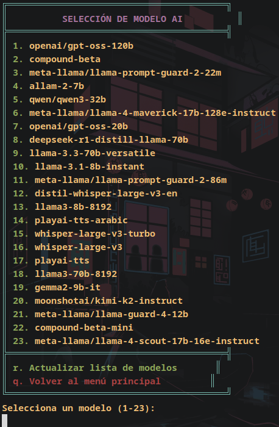
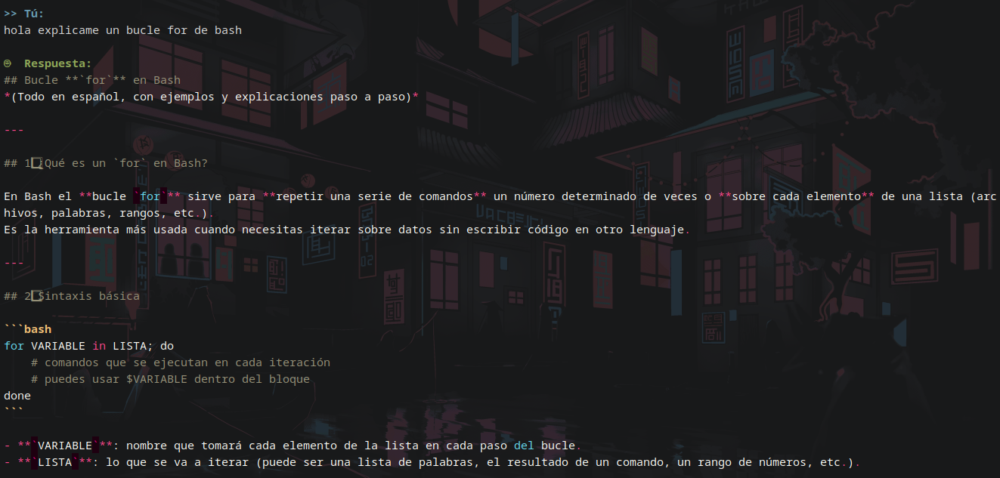

# 🚀 Groq API Chat - Terminal Client


## 🔍 Descripción
Cliente terminal interactivo para la API de Groq con:
- 🌈 Interfaz con sintaxis de colores
- 💾 Gestión de múltiples chats locales
- 🤖 Selección dinámica de modelos
- 🗂️ Historial conversacional persistente
- ⚡ Integración directa con Groq API

## ✨ Características Principales
| Función                  | Descripción                          | Comando          |
|--------------------------|--------------------------------------|------------------|
| 📁 Multi-chat            | Guarda/carga conversaciones          | `/guardar`       |
| 🧠 Modelos              | Soporte para varios modelos de Groq  | Selección en menú|
| ⚙️ Configuración        | Ajusta temperatura/tokens            | Menú configuración|
| 💻 Resaltado de código  | Soporte para Python/JS/JSON          | Automático       |
| 🚀 Modo rápido          | Preguntas directas desde terminal    | `-q "pregunta"`  |

## Menu principal


---

## Menu usuario


## Seleccion de modelo


---

## Interfaz de Usuario


## 🔑 Instalación

1. **Obtén tu API Key**:
   - Regístrate en [Groq Cloud](https://console.groq.com/)
   - Crea una nueva API Key en la sección de configuración

2. **Configura el script**:
   ```bash
   git clone https://github.com/tu-user/groq-chat.git
   cd groq-chat
   nano groq-chat.sh  # Edita la variable API_KEY
   ```
3. **Requisitos**:
	Solo debemos tener instalado **curl** y el parser **jq** y para mejor visualizacion del codigo instalar tambien **pip install pygments**
	
## 🤝 Contribuciones

Haz fork del repositorio

Crea una rama feature (git checkout -b feature/nueva-funcion)

Haz commit de tus cambios (git commit -am 'Añade nueva función')

Haz push a la rama (git push origin feature/nueva-funcion)

Abre un Pull Request

📜 Licencia: MIT
📧 Contacto: @firstatack
🔗 Repositorio: github.com/firstatack/groq_api_chat

⚠️ Nota importante: Este proyecto no está afiliado con Groq, Inc. El uso de la API está sujeto a los Términos de Servicio de Groq. 

## 📞 Contacto

Para soporte o colaboraciones:

📧 Email: tu-email@ejemplo.com  
📱 Telegram: [@firstatack](https://t.me/firstatack)  
🐦 Twitter: [@tucuenta](https://twitter.com/firstatack)

[](https://t.me/tucuenta)
